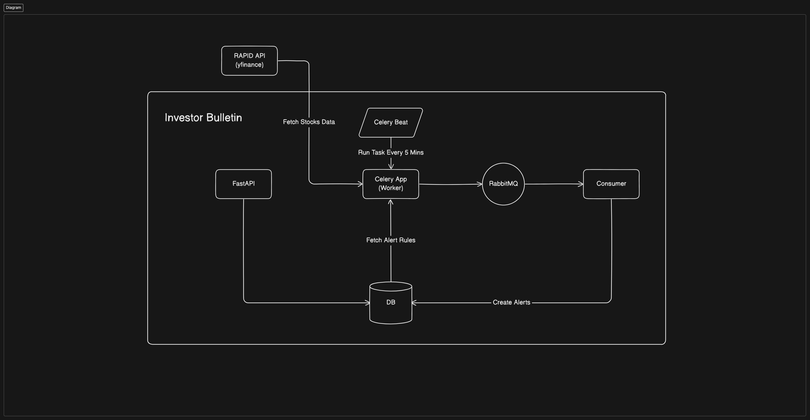

# Investor Bulletin

## 1. Overview:

This project allows users to define certain price condition for stocks and generate alerts in case of price crossover happenes. Further, the app fetches stock markeket data, checks against user defined alert rules, and send/save alerts when stocks cross predifined thresholds. The projct is built using the following tech stack:

- **FastAPI** for backend APIs
- **Pydantic** for data validtion
- **SQLAlchemy** for ORM and database interactions
- **cockroachdb** for database engine
- **RabbitMQ** for message queuing
- **Celery and Celery Beat** for running scheduled background tasks





## 2. Project Setup

### 2.1 Environment Setup
for python environment, I am using `conda` to create an environment and `pip` as package manager.

1. Create a conda environment
    ```sh
    conda create --name malaa-env python=3.11
    ```
2. Install necessary packages
    ```sh
    pip install -r requirements.txt
    ```
3. Start docker containers for cockroachdb and rabbitmq
    ```sh
    make up
    ```
**Note**: Since I have newer version of docker, I modified `up.sh` and `down.sh` to use `docker compose` instead of `docker-compose`

4. Define `PYTHONPATH` in conda environment (to aviod `ModuleNotFoundError`)
    1. locate conda environment directory
        ```sh
        conda env list
        ```
    2. create `activate.d` script
        ```sh
        mkdir -p ~/miniconda3/envs/malaa-env/etc/conda/activate.d
        nano ~/miniconda3/envs/malaa-env/etc/conda/activate.d/env_vars.sh
        ```

    3. Add `PYTHONPATH` in `env_vars.sh`
        ```sh
        export PYTHONPATH=/path/to/your/project
        ```

    4. activate conda environment again
        ```sh
        conda activate malaa-env # to reflect changes made above
        echo $PYTHONPATH # check the set python path
        ```
### 2.2 Running the Application

1. run fastapi app
    ```sh
    uvicorn api.main:app --reload
    ```

2. run consumer
    ```sh
    python event_subscriber/main.py
    ```

3. run celery worker
    ```sh
    celery -A worker.tasks worker --loglevel=info
    ```
4. run celery beat
    ```sh
    celery -A worker.tasks beat --loglevel=info
    ```

Once all components are running, we can start creating alert rules from swagger webpage. the celery app with celery beat will check stock prices and stored alert rules and generate any alerts every 5 mins.

## 3. Components Overview

### 3.1 FastAPI

FastAPI provides RESTful endpoints for creating`Alert` and `AlertRule` based on given requirements and fetching stock market data for selected securities.

the FastAPI app follows three-tier architecture for separation of concern and promoting maintaibility etc.

1. Controller Layer: Handles HTTP requests and responses
2. Service Layer: Contains business logic and acts as intermediate layer between controller and repository layers
3. Repository Layer: Data access layer that interacts with database and carry out transactions

### 3.2 RabbitMQ, Producer, and Consumer

RabbitMQ provides message queue for event-based communication. Further, the producer publishes a message to the exchange(in our case topic exchange is used)in rabbitmq, exchange routes that message to the proper queue using routing key, and then consumer is listening to new messages arriving at the queue to consume them.

In the context of our application, Celery and Celery beat runs a periodic task (runs every 5 minutes) to do the following:
1. Fetch stock market data for given securities,  for example: ```{
    "symbol": "AAPL",
    "price": 229.8174
  }```
2. Get user defined alert rules for provided securities, an example rule:
    ```sh
    {
    "name": "aaple rule 1",
    "threshold_price": 220,
    "symbol": "AAPL",
    "id": "f7d8ae99-a9fa-41aa-ae62-dac3b60b837a"
    }
    ```
3. Generate `Alert` message and puplish it to the exchange in rabbitmq

The consumer then receives the published `Alert` message and prints it to console and also save it in the database

### 3.3 Celery and Celery Beat

Celery app (Worker): defines and execute the task mentioned above

Celery Beat: scheduler that runs defined tasks periodically (in our case every 5 minutes)
